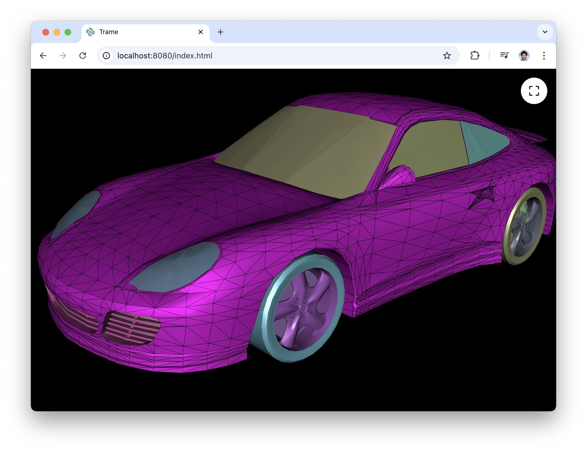

# Picking

This example aim to illustrate how to connect VTK.wasm and make method call on its state.
The code is kept as simple as possible using dummy mesh to just illustrate the core usage of such setup.

## Content

The code show how to create a picker and register to the view so it can be sent to the client side. Then the server make some call to it on the client side and resolved which actor got picked on the server side. When successful, the application change the actor representation to hightlight it.

