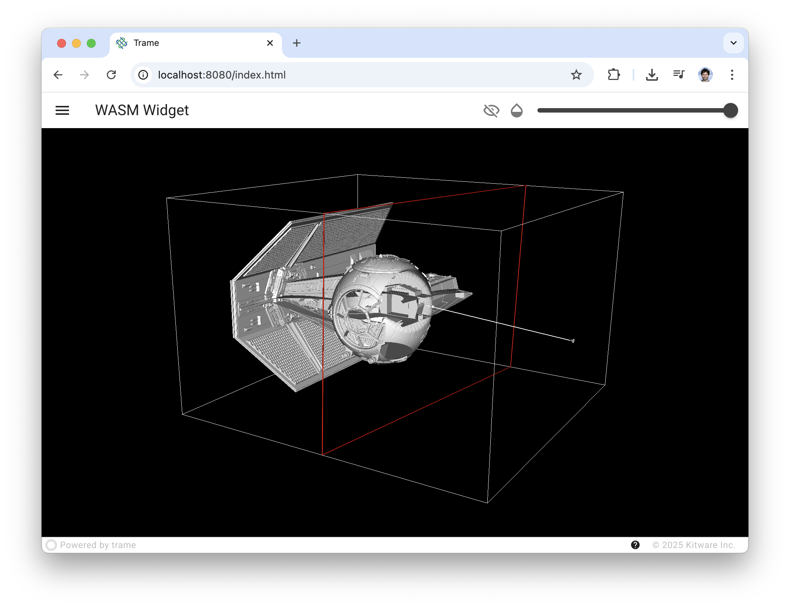

# Clip

This example aim to illustrate how to connect a VTK 3D widget with VTK.wasm and listen to its changes.
The code is kept as simple as possible using dummy mesh to just illustrate the core usage of such setup.

## Content

The code show how to create a widget and register to the view so it can be sent to the client side. Then the example attach some client side listener where client side state get extracted and mapped onto a trame state so we can react to it and update the clip filter with the new plane origin and normal. 

